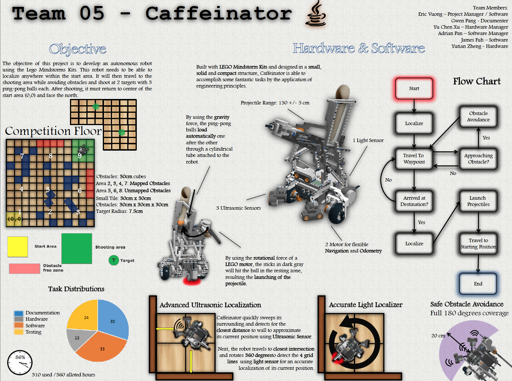

# 1st Place Autonomous Robot Competition
## Winter 2015
### GOAL:
Design an autonomous robot that can navigate on a 12x12 gridlined field where it must be able to locate itself and travel to a desired location while avoiding obstacles.

## Robot project for McGill DPM Class ECSE

-Uses ultrasonic sensors, light sensors, motors to navigate.
-The obstacle avoidance algorithm uses a p-controller algorithm, with moving average, and differential filtering algorithms in Java. 

[YouTube link](https://www.youtube.com/watch?v=3wffSdQt120&feature=youtu.be)

